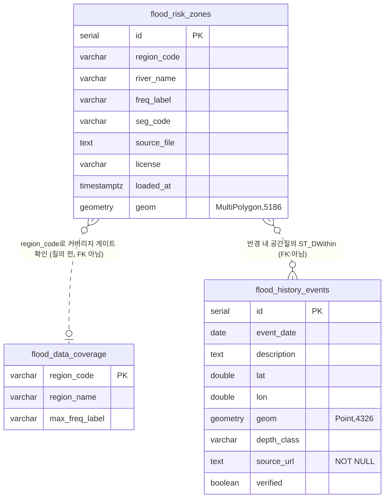

# Build Plan: 담보 기후리스크 여신심사 AI

- 작성: 2026-08-05 (PM) / 대상 독자: **이 프로젝트를 Agentic Coding으로 실제 구현할 새 저장소의 개발 세션.** 구현은 확정 즉시(지금) 시작하며, 9월 해커톤 당일은 발표·Q&A 전용이지 착수 시점이 아니다(mentoring/log.md 2026-08-04 멘토 확정 사실 — 실제 구현은 확정 후 약 3~4주 별도 진행). 이 문서 이전의 리서치 과정·논의는 모른다는 전제로 작성됨 — 필요한 모든 결정과 근거는 이 문서 안에 있다.
- 아이디어 슬러그: `climate-collateral-underwriting-ai`
- 명칭: **"담보 기후리스크 여신심사 AI"** (보험 상품으로 오인될 수 있는 "언더라이팅"이라는 표현은 쓰지 않는다. 기획서·데모 UI 모두 은행 용어로 통일)

## 요약 카드 (본문 정독 전에 먼저 읽을 것)

- **한 줄**: 담보 주소 입력 → 침수심·건물취약도·EAL 계산 → 근거 인용 심사메모 생성. 기상특보 발효 시 **경보지역 담보만** 즉시 재계산(임계치 초과분만 알림) + 정기 배치로 전체 포트폴리오 보완(혼합형 구조).
- **스코프 확정(2026-08-07)**: 포항 냉천(인덕동) + 대구 신천(남구·봉덕동) 둘 다 메인 앵커 — iM뱅크 자산이 대구·경북에 집중된 서사와 정합. 신천 나머지 4개 지점은 판정보류 → 커버리지 게이트 정직성 시연 소재로 채택(배제 아님).
- **LLM·배포 확정(2026-08-07)**: Anthropic API 직접 호출(국내 리전 전환은 상용화 로드맵으로 이연, 대안 HyperCLOVA X는 검토 후 미채택). 배포는 **로컬 실행**(공인IP·VPC·DNS·HTTPS 인증서 전부 불필요).
- **아키텍처 한 줄**(④ 상세): LangGraph 오케스트레이션 — 홍수·특보·건물취약도 3에이전트 병렬 fan-out → 시나리오 에이전트(몬테카를로 EAL) → 메모 에이전트(LLM+인용검증 게이트) → 평가 대시보드 9개 지표(계량5·LLM4).
- **핵심 데이터**(②): `data/climate-collateral-underwriting-ai/raw/`의 SHP 6개(냉천1+신천5), `.env`의 API키(건축HUB·기상특보·V-World 실키 검증 완료, safemap GetMap은 HTTP 500으로 폐기·범례API만 사용).
- **착수 순서**(⑦): Week1 GIS 스파이크(point-in-polygon+커버리지게이트, 최우선) → Week2 계량코어(홍수·건물취약도·EAL) → Week3 LLM+특보+포트폴리오+규율UI → Week4 평가+레드팀+마감.
- **절대 지킬 것**(①·⑥): 소급불리 적용 금지·인센티브는 인하방향만·인용 강제(근거 없는 문장 렌더링 차단)·EAL 시드 재현성·"데이터 없음≠위험 없음"(커버리지 게이트).
- **최근 반영된 멘토 피드백(2026-08-05/07)**: 특보 트리거는 전체가 아닌 지역 필터링 재계산, 알림은 수치로 표시, 지오코딩 confidence 낮으면 별도 플래그, 알림 정밀도(오탐) 지표 추가, 타 시스템 연동은 MVP 범위 밖(독립 도구로 완결).
- **본문에서 더 볼 것**: ② 데이터/API 상세표, ③ 데모 시나리오, ④ 아키텍처 전체 스펙, ⑤ 약속 기능 목록, ⑥ 규제·레드팀 9개, ⑦ 착수순서·WBS·Definition of Done 표.

---

## ① 확정 아이디어 요약

**"담보 주소 하나를 입력하면 물건 단위 기후리스크 스코어와 근거 인용 심사메모가 나오고, 기상특보가 발효되면 포트폴리오 전체가 실시간 재계산된다."**

iM뱅크는 원화대출금의 **72.1%(대구 56.7%+경북 15.4%)가 대구·경북에 집중**(한국신용평가, 2025.9말)되어 단일 재해 이벤트에 포트폴리오가 동시 노출된다(2022 힌남노: 포항 피해 약 2조, 주택 8천가구·상가 1.4만곳 침수). 금감원은 "전사적·상시" 기후리스크 관리를 요구하지만(기후 스트레스테스트 손실 45.7조, 지방 제조업 밀집지역 취약 공식 확인) 은행의 실제 도구는 연 1회 하향식 분석 수준 — 이 격차를 **공공데이터만으로 만든 물건 단위 상시 도구**로 메운다.

핵심 포지셔닝 (변경 금지):
1. **심사역용 B2B 내부 도구** — 스코어는 자동 결정이 아닌 참고 정보(HITL), 최종 LTV·금리 결정은 심사역
2. **스코어 근거가 물리 데이터**(침수심 등급·하천 거리·건물 구조·연식·지하층)로 완전 추적 — 태생적 설명가능(XAI)
3. 혁신성 주장은 "세계 최초"가 아니라(무디스·S&P·Jupiter 해외 상용화 존재) **"국내 공공데이터 경량판 + 실시간 특보 연동 재심사 트리거 + 심사메모 수직 통합"** 3축으로 방어 — 글로벌 벤더는 정적 장기 시나리오 스코어에서 끝나고, 특보 연동 상시 운영 계층과 심사 문서 생성은 없음
4. 주제 ①(디지털)+②(ESG) 동시 충족: 금감원장 최상위 신호(기후리스크) 직결, ESG 사슬의 성과검증(리스크 계량)+대상선정(전환금융 추천) 고리

> **구현 세부 사항 (2026-08-05 멘토 피드백 반영, mentoring/log.md)**: 위 한 줄 소개의 "포트폴리오 전체가 실시간 재계산"은 사용자에게 보이는 결과(경보 발생 시 관련 담보가 즉시 재평가되고, 전체 포트폴리오 위험 현황도 주기적으로 갱신됨)를 압축한 표현이다. 실제 구현은 특보 발효 시 **경보지역으로 필터링한 서브셋만 즉시 재계산**하고, 나머지 전체 포트폴리오는 §4.1.1의 다층 주기 정기 배치로 별도 갱신하는 **혼합형 구조**다 — 매 특보마다 300~500건 전체를 반복 계산하지 않는다("전체 담보를 매일 반복 계산하기보다 영향지역을 선별해 즉시 재평가하고 정기 배치로 보완하는 구조가 은행 실무에 더 적합"). 상세는 ④ 참조. handover·PPT·신청서의 해당 문구를 이 구조에 맞춰 조정할지는 PM 판단 대기.

### 확장성 원칙 (구현 전반에 적용)

- **데모 범위와 확장 로드맵을 분리한다.** 데모 자체(냉천·신천 등 소수 하천)는 좁고 확실하게 작동시키고, "전국 하천 확장"·"safemap 이미지 판독 추가"·"담보물권 유형 확장" 등은 별도 로드맵으로 제시한다 — 데모 범위와 뒤섞으면 "실제 작동하는가"가 흐려진다.
- **정적 가정을 하드코딩하지 않는다.** 특정 지역·조건을 고정 가정으로 박아넣지 말고, 매 요청마다 최신 데이터(기상특보 등)를 조회해 재계산하는 구조를 유지한다 — 이것이 "기후 패턴이 이동해도 재학습 없이 다음 조회부터 자동 반영된다"는 적응성 주장의 근거가 된다. (주의: 기후 패턴 변화 자체를 예측하는 모델은 이 프로젝트의 범위가 아니다 — 시도하지 말 것.)
- **아키텍처는 하천/지역 수를 하드코딩하지 않는다.** PostGIS 스키마·point-in-polygon 질의 인터페이스(④ 참조)는 SHP 추가만으로 전국 확장이 가능하도록 설계돼 있다 — 데모가 2개 하천으로 좁은 것은 데이터 커버리지(다운로드된 파일 수) 제약이지 아키텍처 제약이 아니라는 점을 방어 논리로 사용할 것.
- **알림 채널 확장(로드맵, 2026-08-05 멘토 피드백)**: 대시보드 조회에 그치지 않고 구글 푸시·카카오 연동으로 심사역에게 능동적으로 알림을 전달하는 것을 확장 로드맵으로 제시한다("대시보드로 그치면 실무에서 잘 안 보게 된다") — 발표 시 실제 연동보다 "이런 확장도 가능하다"는 어필 수준. **선행 조건**: 오탐·과다경보로 심사역이 시스템을 외면할 리스크가 있어, 알림 임계치·발송 빈도 제한 설계(④ 4.1.1)가 채널 연동보다 먼저다.
- **은행 기존 시스템 실연동은 MVP 범위 밖(로드맵, 2026-08-05/07 멘토 피드백)**: 여신심사·담보관리·감정평가·GIS·사후관리 등 실제 심사 업무는 여러 시스템과 맞물려 있어 전체 연동 시 개발비용이 커진다는 지적 — MVP는 이 연동 없이 **독립 조회 도구(스코어·심사메모를 API/화면으로 제공)**로 완결시키고, 각 시스템과의 실연동은 상용화 단계에서 시스템별로 순차 검토한다는 것을 방어 논리로 사용한다.

### 보호형 사용 규율 4항 (블루라이닝 방어 — 기획서·데모 필수 반영, 위반 시 서사 붕괴)
1. 신규 심사: 스코어는 심사역 참고 정보(HITL)
2. **기존 차주 소급 불리 적용 금지** — 조기경보를 기존 대출의 LTV 하향·금리 인상·회수 트리거로 쓰지 않음. 경보의 액션은 보험 가입 확인·피해 점검·재해 시 지원 연결
3. **인센티브는 인하 방향만** — 차수판·방수 설비 등 적응 투자 시 우대
4. 서사: "위험 지역을 걸러내는 도구"가 아니라 **"지역을 떠날 수 없는 지역은행이 기후 취약 자산을 찾아 적응 투자·보험·지원으로 연결하는 적응 금융 도구"**
- 예상 공격 질문("저지대 상가 대출 조여서 지역 부동산 죽이는 것 아닌가")에 대한 방어는 ⑥ 레드팀 시나리오 9 참조.

---

## ② 데모용 데이터/API 목록 (실접근 검증 결과 반영)

| # | 용도 | 데이터/API | 접근 방식 | 실접근 검증 결과 | 구현 착수 전 확인 필요 |
|---|---|---|---|---|---|
| 1 | 침수 위험 판정 (핵심, 유일한 1차 경로) | 홍수위험지도 GIS SHP — `data.floodmap.go.kr/main/board/map_data_download` (공공데이터포털 15077744) | 파일을 브라우저로 수동 다운로드 후 로컬 적재, **point-in-polygon 질의** (④ 참조) | 포항시 남구(냉천, 기왕최대 빈도) — 다운로드·검증 완료, 중류(인덕동·냉천로 인근) 폴리곤 내부 확인. 대구 5개구(신천, 500년 빈도) — 다운로드 완료, point-in-polygon은 남구(봉덕동) 1개 지점만 확정, 나머지 4개 구간(중구·수성구·동구·북구)은 36~400m 밖으로 나와 **판정보류**(좌표 오차인지 실제 커버리지 밖인지 불명) | 다운로드 게시판이 완전한 클라이언트사이드 SPA라 자동화 접근 불가 — 신규 지역/빈도를 추가하려면 매번 사람이 브라우저로 직접 다운로드해야 함. 신천 판정보류 구간을 데모에 쓸지는 ⑦ 스코프 결정에 따름 |
| 2 | 침수흔적(실측 이력) 메타데이터 (보조) | 생활안전지도 오픈API(safemap) — 신세대 엔드포인트 `openapi2/lgdInfo`(범례) | 무료 인증키(승인 확정) | 범례 API는 정상 작동 확인(6단계 침수심 분류 색상·기준 반환). **이미지 엔드포인트(`openapi2/IF_0092_WMS`, GetMap)는 키 유효성과 무관하게 HTTP 500 고정** — 유효 키·무효 키·문서 예시 bbox 셋 다 동일하게 500이 나와, 키 미승인이 아니라 이 엔드포인트 자체(또는 이 호출 경로)의 서버측 문제로 판단됨. GetFeatureInfo는 이 API에 애초에 존재하지 않는 오퍼레이션(공식 파라미터 목록에 `REQUEST` 자체가 없음, OGC 표준 WMS가 아니라 데이터셋별 전용 코드로 쪼갠 커스텀 래퍼) | GetMap 500이 구현 착수 시점까지 지속되는지 재확인 필요. **지속되면 이 소스는 침수심 등급 메타데이터(범례) 조회에만 쓰고, 실측 침수 이력의 공간 데이터는 수동 큐레이션 테이블로 완전히 대체한다**(④ §3.3 `flood_history_events` 참조) — "실시간 침수흔적 오버레이"라는 표현은 이 상태에서는 쓰지 않는다 |
| 3 | 건물 취약도 | 국토부 건축HUB 건축물대장 API `getBrTitleInfo` (data.go.kr/data/15134735) | 무료 키, 일 10,000건, JSON | 실키로 `resultCode: "00", NORMAL SERVICE` 확인, 구조·주용도·지하층수·연식 4개 필드 정상 반환 | 없음 — 즉시 사용 가능 |
| 4 | 특보 트리거 | 기상청 기상특보 조회 API `WthrWrnInfoService/getWthrWrnList` (data.go.kr/data/15000415) | 무료 키 | 실키로 최근 날짜 실호출 성공 — 라이브 재심사 트리거 경로로 실증 완료 | 없음. 단 힌남노(2022-09) 리플레이는 API 과거조회가 아니라 **기상청 보도자료 등 공개 출처가 명시된 정적 큐레이션 데이터로 구현**(④ §3.3 `source_url NOT NULL` 제약 참조) — 출처 미표기 시각·수치는 절대 사용 금지 |
| 5 | 지오코딩 | V-World Geocoder 2.0 (`api.vworld.kr/req/address`) | 무료, 일 3만건 | 실키로 `status: "OK"` 확인 | 없음 — 즉시 사용 가능 |
| 6 | 침수심 통계 (보조, 지역 개요 화면용) | 한강홍수통제소 침수심 통계 API군 (15141705 등) | 무료 REST | **정확한 오퍼레이션명 미확정** — 참고문서 링크 없음, data.go.kr 카탈로그는 스펙이 아닌 설명 메타데이터뿐, 한강홍수통제소 자체 포털에는 이 서비스 자체가 없음, 웹서치로도 매치 실패. 실호출 자체를 구성하지 못한 상태 | data.go.kr 로그인 후 Swagger UI를 브라우저로 직접 여는 것이 유일한 경로. **물건 단위가 아니라 시군구 단위 보조 통계**라 데모 핵심 경로가 아님 — 시간 부족 시 스킵 가능(⑦ 축소 우선순위 참조) |
| 7 | 여신 포트폴리오 | **합성 데이터** 300~500건(대구·포항 실주소 기반: 주소·담보유형·잔액·LTV) | 직접 생성 | — (유일한 합성 데이터 축. 은행 내부에 실존하고 스폰서가 은행 본인이라 접근 경로는 자명함) | 분포 가정치의 근거 문헌 없음(초기 추정치로 진행). **초기 구현은 30~50건 소표본으로 시작**하고 파이프라인이 안정된 뒤 확대할 것(⑦ Week 3 참조) — 포항 냉천·대구 신천 등 실제 침수 이력 지역 비중을 의도적으로 포함시킬 것 |

**공공누리 라이선스 (최대 지뢰 — #1 관련)**: 홍수위험지도는 공공누리 4유형(출처표시·상업이용 금지·변경 금지). 데모(비영리)는 출처표시로 성립하되, **원본을 재배포하지 말고 "원본 지도에 좌표를 넣어 질의(조회·판독)하는" 형태로만 사용**할 것 — 파생 스코어의 대량 export·재배포 기능은 아예 구현하지 않는다(⑥ 참조). 상용화 단계는 한강홍수통제소 별도 이용허락이 전제.

---

## ③ 최소 데모 시나리오 ("태풍 리플레이" — B2B 대시보드의 낮은 체감 극복 구성)

페르소나: iM뱅크 여신 심사역

1. **물건 단위 스코어링(라이브)**: 주소 1건 입력(**포항 냉천 인덕동 또는 대구 신천 남구·봉덕동** 등 확정 좌표 — ⑦-1 스코프 결정) → V-World 지오코딩 → 홍수위험지도 SHP point-in-polygon 질의(침수심 티어) + safemap 범례 API(침수심 등급 메타데이터) + 수동 큐레이션 실측 이력 조회 + 건축물대장 API 실시간 호출(구조·연식·지하층) → 멀티에이전트 병렬 분석 → 리스크 스코어 + 연간기대손실(EAL) 몬테카를로 분포 + **근거 인용 심사메모 초안**
2. **클라이맥스 — 힌남노 리플레이**: 2022-09-06 기상특보 타임라인(정적 큐레이션 데이터) 재생 → 특보 발효 순간 **경보지역(포항 남구) 담보만 필터링**해 지도가 붉게 물들며 익스포저 재계산(전체 300~500건이 아니라 대상 지역 서브셋 — ④ 4.1 참조) → "고위험 담보 상위 10건 · 재심사 트리거 · 보험 커버리지 미확인 3건" 알림(임계치 초과분만) → 건별 재심사 메모 자동 생성 → 실제 피해액(포항 약 2조)과 대조
3. **커버리지 게이트 시연**: 임의의 SHP 미커버 좌표(또는 신천 판정보류 좌표)를 입력 → 시스템이 "위험 없음"으로 조용히 넘기지 않고 명시적으로 "판정보류/OUT_OF_SCOPE"를 반환하는 것을 보여줌 — 블루라이닝 방어 규율 2항("소급 불리 적용 금지")과 짝을 이루는 "데이터 공백을 위험 없음으로 둔갑시키지 않는다"는 정직성의 기술적 증거
4. **ESG 화면**: 고위험 담보 목록 → 재해예방 설비 개선자금(전환금융) 추천 리스트 — 보호 규율 3항(인센티브 온리)의 시각적 증거
5. 데모 내 경보 액션 문구 주의: "LTV 하향·금리 인상"이 아니라 "보험 확인·피해 점검·지원 연결"로 표기 (보호 규율 2항)

**규모 참고**: 초기 구현(Week 3)은 30~50건 소표본으로 이 시나리오를 완주시키고, 안정화 후 300~500건으로 확대한다 — 확대 자체가 목적이 아니라 "확대해도 커버리지 게이트·인용검증이 깨지지 않는다"를 보여주는 것이 목적이므로 시간이 부족하면 소표본 상태로 발표해도 무방하다.

---

## ④ AI 아키텍처

### 4.1 시스템 개요 및 데이터 흐름

```
[사용자 입력: 주소 1건 또는 포트폴리오 배치 트리거]
        │
        ▼
  [지오코딩 전처리] — V-World Geocoder (실키 검증됨)
        │  주소 → WGS84 좌표
        ▼
  ┌─────────────────────────────────────────────┐
  │        LangGraph fan-out (병렬 3노드)          │
  │  ① 홍수 에이전트   ② 특보 에이전트  ③ 건물취약도 에이전트 │
  └─────────────────────────────────────────────┘
        │  (3개 output 모두 JSON, 각 필드에 source 표기)
        ▼
  [시나리오 에이전트] — 몬테카를로 EAL (순차, 위 3개 입력 필요)
        │
        ▼
  [메모 에이전트] — LLM 심사메모 초안 생성 (순차, 시나리오 output 필요)
        │
        ▼
  [인용검증 레이어] — citation 없는 문장 렌더링 차단 (게이트)
        │
        ▼
  [평가 대시보드] — 계량축 4지표 + LLM축 4지표 실시간 표시
        │
        ▼
  [출력: 리스크 스코어 + EAL 분포 + 근거 인용 심사메모]

[포트폴리오 재계산 모드 — 특보 트리거 기반 "지역 필터링" 재계산 (혼합형 구조, 2026-08-05 멘토 피드백 반영)]
  기상특보 API 발효 이벤트 감지
  → 경보 종류·경보지역 코드 확인 (특보 에이전트가 이미 추출하는 대상지역 필드를 재사용 — 별도 파싱 불필요)
  → 포트폴리오에서 해당 지역 코드에 매칭되는 담보만 추출 (전체가 아니라 대상 지역 서브셋)
  → 추출된 서브셋만 위 그래프(홍수·건물취약도·시나리오 에이전트)로 재계산
  → LTV·EAL 영향 확인 → 임계치(EAL 변화율 또는 스코어 절대값) 초과 담보만 "재심사 알림 큐"에 등재
    → 알림 항목은 **정성 라벨("고위험")이 아니라 수치로 표시**(2026-08-05/07 멘토 피드백 — "심사역 대상 지표이니 수치로 가야 함"):
      `{collateral_id, score_before, score_after, EAL_before, EAL_after, EAL_change_pct, threshold, geocode_confidence}`
    (LTV·금리 자동 변경 금지 — ① 보호 규율 2항)

  ※ 전체 포트폴리오(경보와 무관한 지역 포함) 위험 점검은 이 트리거의 몫이 아니다 — 4.1.1 정기 배치가 담당
```

**설계 원칙 (모든 에이전트 공통, 절대 위반 금지)**:
1. **데이터 없음 ≠ 위험 없음**: 좌표가 SHP 커버리지 밖이거나 API 호출이 실패하면 "위험 낮음"으로 조용히 대체하지 않고 명시적 "미판정/커버리지 밖" 상태를 반환한다. 데이터가 없다고 위험을 과소평가하면 취약 담보를 놓치는 실패가 되며, 이는 블루라이닝 방어 규율과도 직결된다.
2. **금전적 트리거는 관측 원자료에만 앵커링**: 특보 에이전트의 출력은 "알림"에만 연결되고, EAL·스코어 계산에는 침수심·건물취약도 등 물리 관측치만 입력된다. 특보를 금전 조건에 직결하면 규제·게이밍 공격면이 열린다.
3. **핵심 계량 코어는 화이트박스**: 홍수·건물취약도·시나리오 에이전트는 딥러닝이 아니라 공간질의·규칙함수·몬테카를로로 구성 — 산출값이 어떤 원자료·어떤 계수에서 나왔는지 100% 역추적 가능해야 한다("태생적 설명가능"이 핵심 포지셔닝 2).
4. **전체 재계산과 트리거 재계산을 분리한다**(2026-08-05 멘토 피드백, mentoring/log.md): 특보 트리거는 경보지역 서브셋만 즉시 처리하고, 전체 포트폴리오 점검은 4.1.1의 다층 주기 정기 배치로 넘긴다 — 매일 전체를 반복 계산하는 것은 비효율이라는 지적을 반영.

### 4.1.1 정기 배치 스케줄 (특보 트리거와 병행 — 2026-08-05 멘토 피드백 반영)

특보 트리거가 놓칠 수 있는 "경보 없는 지역의 서서히 진행되는 위험"과 "장기 시나리오·모델 자체의 노후화"를 보완하기 위해, 아래 주기의 정기 배치를 특보 트리거와 별도로 병행한다.

| 항목 | 주기 |
|---|---|
| 담보위험 전체 점수 + 포트폴리오 집중위험 재계산 | 월 1회 |
| 담보가치·LTV 종합점검 | 월 1회 또는 분기 1회 |
| 장기 기후 시나리오 재평가 | 분기 1회 또는 반기 1회 |
| 모델 검증 및 임계치 조정 | 반기 1회 또는 연 1회 |

**MVP 범위 경계**: 이 정기 배치의 스케줄러(cron 등) 자체는 해커톤 데모에서 라이브로 구동하지 않는다 — 데모는 "특보 트리거 기반 즉시 재계산"(위 다이어그램)만 실시연하고, 이 다층 주기 정기 배치는 ⑤ 기능 목록·발표 자료상 로드맵으로 제시한다.

핵심/보조 AI 구도: **핵심 AI** = ①계량 코어(홍수 공간질의 + 건물취약도 규칙 함수 + 몬테카를로 EAL — 전부 결정론적, ML/LLM 아님) + ②LLM 메모 에이전트(심사메모 생성, 출처 인용 강제). **보조 AI** = 특보 파싱 LLM(원문 요약·이벤트 추출만, 트리거 판단 자체는 규칙기반).

### 4.2 에이전트/모듈별 상세 스펙

**2.0 지오코딩 전처리 (유틸리티, 에이전트 아님)**
- 입력: 주소 문자열 → V-World Geocoder 2.0 호출 → 출력: `{lat, lon, matched_address, confidence}` (WGS84)
- 실패 시: "주소 수정 요청" 반환, 좌표 없이는 어떤 에이전트도 실행하지 않음
- **저신뢰도 매칭 처리(2026-08-05/07 멘토 피드백)**: 도로명주소→좌표 변환 자체가 오탐 원인이 될 수 있다는 지적 — `confidence`가 임계치(잠정치, 실측 캘리브레이션 필요) 미만이면 매칭 실패와 달리 파이프라인은 계속 진행하되 `geocode_confidence: "LOW"` 플래그를 홍수 에이전트·커버리지 게이트로 전달, "좌표 신뢰도 낮음 — 결과 참고용" 경고를 병기(설계 원칙 1 "데이터 없음≠위험 없음"의 확장)

**2.1 홍수 에이전트 (Flood Agent)**
- 입력: `{lat, lon}`, `search_radius_m`(기본 500m)
- 처리: ① WGS84→EPSG:5186 좌표계 변환 ② point-in-polygon 판정(`ST_Contains`) ③ 내부가 아니면 최근접 거리로 3단계 티어 분류(**내부 0m** / **근접 ≤100m** / **원거리 >100m**) ④ 좌표가 로딩된 SHP 커버리지 밖이면 판정 자체를 생략하고 `coverage: "OUT_OF_SCOPE"` 반환(설계 원칙 1) ⑤ 반경 내 `flood_history_events`(수동 큐레이션 실측 이력) 조회해 교차 등급화 참고자료로 병합
- 출력: `{coverage: "IN_SCOPE"|"OUT_OF_SCOPE", in_polygon, tier, distance_to_polygon_m, freq_label, source_shp_file, license: "공공누리4유형", methodology_disclaimer, history_events: [...]}`
- 사용 모델: 없음 — 순수 결정론적 공간질의(PostGIS SQL 또는 shapely)
- 실패 시 폴백: PostGIS 연결 실패 시 로컬 shapely+STRtree 캐시로 즉시 전환. 그래도 실패하면 "침수 판정 불가 — 원자료 접근 실패"로 명시 반환하고 심사메모 생성 자체를 차단(허수 스코어 방지)

**2.2 특보 에이전트 (태풍·폭염 에이전트)**
- 입력: `{lat, lon}` 또는 행정동 코드, `mode: "live"|"replay"`
- 처리(live): 기상청 특보 API 호출 → 특보 원문을 LLM으로 구조화 파싱(발효 시각·종류·대상지역) → 규칙기반 트리거 판정(발효=알림, 금전 조건과 분리)
- 처리(replay): 사전 정리된 힌남노 타임라인(출처 URL 명시된 정적 JSON)을 타임스탬프 기준 재생 — API 호출 없음
- 출력: `{active_warnings: [{type, issued_at, source_url}], trigger_event: bool, mode}`
- 사용 모델: 보조 AI(LLM) — 원문 파싱·요약에만 사용, 트리거 여부 자체는 규칙(boolean)이라 LLM 출력이 트리거를 좌우하지 않음
- 실패 시 폴백: live API 실패 시 마지막 캐시된 특보 상태 유지 + "갱신 실패, 마지막 확인 HH:MM" 배너. **replay 데이터는 출처 URL 없는 이벤트는 로딩 자체를 거부**(DB 제약으로 강제)

**2.3 건물취약도 에이전트**
- 입력: 주소 또는 PNU
- 처리: 건축HUB `getBrTitleInfo` 호출 → 구조·주용도·지하층수·연식 추출 → 취약도 함수 적용: `vulnerability_score = w1·f(구조재질) + w2·f(지하층수) + w3·f(연식) + w4·f(주용도)` (각 항 0~100 정규화, **가중치 w1~w4는 현재 초기 추정치 — 문헌 근거 미확정**, ⑦ B2 참조)
- 출력: `{vulnerability_score, contributing_factors: [...], source, missing_fields}`
- 사용 모델: 규칙기반 함수(ML 아님). 향후 실손해 데이터 확보 시 로지스틱 회귀 등으로 캘리브레이션하는 것은 로드맵 항목
- 실패 시 폴백: 필드 결측 시 `missing_fields`에 기록하고 나머지 항목에 비례 재분배 + "일부 정보 누락 — 보수적 상한 적용" 명시. API 자체 실패 시 취약도 산출 보류하고 "부분 스코어(건물 정보 미확인)" 명시

**2.4 시나리오 에이전트 (몬테카를로 EAL)**
- 입력: 홍수 에이전트 output, 건물취약도 output, 담보가액·여신잔액
- 처리: 강우 빈도-침수심 분포(기상청 30년 확률강우량 통계) × 손상함수(취약도 스코어로 스케일) → 몬테카를로 시뮬레이션(기본 10,000회) → 손실률 분포 → `EAL = E[손실률 × 담보가액]`
- 출력: `{EAL_mean, EAL_p50, EAL_p95, EAL_p99, n_iterations, seed, distribution_histogram_bins, methodology_note}`
- 사용 모델: 계량 코어(numpy/scipy, LLM/ML 아님)
- 실패 시 폴백: 입력 3종 중 하나라도 결측·"판정 불가"면 시뮬레이션 자체를 실행하지 않고 `EAL: null, reason: "입력 데이터 불충분"` 반환 — 허수 EAL 원천 차단

**2.5 메모 에이전트 (LLM)**
- 입력: 위 4개 에이전트의 구조화 JSON output 전체(각 필드가 `source_id`를 가짐)
- 처리: "각 문장은 반드시 하나 이상의 `source_id`를 인용해야 하며, 인용 불가능한 주장은 생성하지 말라"는 지시 + 구조화 출력 스키마(`{sections: [{text, citations: [source_id, ...]}]}`)로 강제
- 출력: `{sections: [{text, citations}], rejected_sentences: [{text, reason}]}`
- 사용 모델: 핵심 AI — LLM(Claude, Anthropic API 직접 호출 — ⑦ A3 확정)
- 실패 시 폴백: 인용 실패율이 임계치(예 30%) 초과 시 LLM 생성 전체를 폐기하고 4개 에이전트 output을 규칙기반 정형 템플릿(표)으로 자동 대체 + "LLM 메모 생성 실패 — 원자료 표 참조" 배너

**2.6 인용검증 레이어 (게이트, 후처리 컴포넌트)**
- 입력: 메모 에이전트 output
- 처리: 각 문장의 `citations`가 실제 소스 레지스트리에 존재하는지 런타임 대조 → 미존재/빈 배열 문장은 렌더링 차단(삭제 또는 취소선, 데모 시연 포인트)
- 사용 모델: 규칙기반 대조(경량) + 필요 시 claim 단위 entailment 검증용 보조 판정 LLM

### 4.3 침수 GIS 레이어 상세 설계 (확정 방식: 로컬 SHP 사전 적재 + point-in-polygon)

**배경**: safemap `openapi2/IF_0092_WMS`(GetMap 이미지)가 키 유효성과 무관하게 HTTP 500 고정이라, 라이브 WMS 타일 판독 경로는 사용하지 않는다. GetFeatureInfo도 이 API 설계에 구조적으로 존재하지 않는다. 홍수위험지도 SHP는 포항시 남구(기왕최대 빈도) + 대구 5개구(500년 빈도)가 다운로드·검증 완료된 상태다.

**SHP 데이터 로딩 파이프라인**:
1. 원본: SHP 파일셋(.shp/.shx/.dbf/.prj), 좌표계 EPSG:5186(KGD2002 중부원점 2010)
2. 로딩: `geopandas.read_file()` → `GeoDataFrame.to_postgis()` (또는 `ogr2ogr` 배치) — 좌표계는 원본 5186 그대로 저장(질의 시점에만 WGS84 입력을 변환)
3. 메타데이터 태깅: `region_code`, `river_name`(수동 태깅), `freq_label`, `source_file`, `license: "공공누리4유형"`, `loaded_at`
4. 재현성: 로딩 스크립트는 idempotent(기존 테이블 truncate 후 재적재) — 동일 SHP 재실행 시 동일 레코드 수·geometry 해시가 나오는지 CI에서 검증

**PostGIS 스키마**:
```sql
-- 침수 위험 시뮬레이션 폴리곤 (환경부 홍수위험지도 SHP 원본)
CREATE TABLE flood_risk_zones (
  id            SERIAL PRIMARY KEY,
  region_code   VARCHAR(10),
  river_name    VARCHAR(50),
  freq_label    VARCHAR(20),
  seg_code      VARCHAR(20),
  source_file   TEXT,
  license       VARCHAR(30) DEFAULT '공공누리4유형',
  loaded_at     TIMESTAMPTZ DEFAULT now(),
  geom          GEOMETRY(MultiPolygon, 5186) NOT NULL
);
CREATE INDEX idx_flood_risk_zones_geom ON flood_risk_zones USING GIST (geom);

-- 커버리지 마스크 (커버리지 게이트용)
CREATE TABLE flood_data_coverage (
  region_code   VARCHAR(10) PRIMARY KEY,
  region_name   VARCHAR(50),
  max_freq_label VARCHAR(20)
);

-- 실측 침수 이력 (수동 큐레이션, safemap GetMap 불가 대체)
CREATE TABLE flood_history_events (
  id            SERIAL PRIMARY KEY,
  event_date    DATE,
  description   TEXT,
  lat           DOUBLE PRECISION,
  lon           DOUBLE PRECISION,
  geom          GEOMETRY(Point, 4326),
  depth_class   VARCHAR(20),
  source_url    TEXT NOT NULL,    -- 출처 URL 필수 제약
  verified      BOOLEAN DEFAULT FALSE
);
CREATE INDEX idx_flood_history_geom ON flood_history_events USING GIST (geom);
```

**ERD** (참고용 — 아래 3개 테이블은 FK 제약이 없다. `region_code`·공간 반경조회는 전부 애플리케이션 레벨 질의이지 DB 제약조건이 아니다):



**point-in-polygon 질의 인터페이스**: `query_flood_risk(lat, lon, radius_m=500) -> FloodRiskResult`
- **1차 경로(프로덕션 지향)**: PostGIS SQL (`ST_Contains`/`ST_Distance`, GIST 인덱스로 가속)
- **2차 경로(로컬/오프라인, 이미 실증에 쓰인 스택 — 개발 초기 1차 구현체로 권고)**: `pyshp`+`shapely`+`pyproj`로 GeoDataFrame 메모리 적재, `shapely.STRtree`로 공간 인덱스 구축 + prepared geometry 결합. PostGIS 서버 없이도 데모 가능
- **커버리지 게이트**: 질의 전 `flood_data_coverage`(또는 로컬 하드코딩 리스트)로 좌표가 로딩 범위인지 우선 확인 → 범위 밖이면 `OUT_OF_SCOPE` 즉시 반환

### 4.4 평가지표 정의 (측정 방법 포함)

**계량축 (홍수·건물취약도·시나리오 에이전트 대상)**

| 지표 | 정의 | 측정 방법 |
|---|---|---|
| EAL 분포 재현성 | 동일 seed 재실행 시 산출값 동일 여부 | `numpy.random.default_rng(seed)` 고정, CI에서 재실행해 `EAL_mean`·`EAL_p95` 등이 허용오차 내 일치하는지 자동 검증 |
| 입력 감도분석 | 어떤 입력이 EAL을 가장 좌우하는가 | 취약도 가중치·강우분포 파라미터를 ±10% perturbation 후 EAL 변화율(elasticity) 계산, tornado chart로 평가 대시보드에 표시 |
| 실측 침수흔적 대비 정합성 | 실제 침수 지점이 모델상 고위험으로 분류되는가 | 실증된 좌표(냉천 인덕동=내부, 신천 남구=내부 등)를 골든셋으로 고정해 recall 산출. **표본이 6~10개 지점 수준으로 통계적 유의성이 낮음을 명시** — 대량 검증은 이후 과제 |
| 커버리지 게이트 회귀 테스트 | "데이터 없음"이 "위험 없음"으로 오판되지 않는가 | 신천 판정보류 지점 + SHP 미커버 임의 좌표를 고정 회귀 케이스로 등록 → 매 배포마다 `OUT_OF_SCOPE`/판정보류를 반환하는지(`in_polygon: false`로 조용히 넘어가지 않는지) 자동 검증 |
| **알림 정밀도(트리거 오탐 방지 검증)** | 재심사 알림이 실제로 유의미한 위험 변화였는가 — "오탐이 많이 갈 수 있다"는 멘토 지적(2026-08-05/07)에 대한 방법론 방어 | 골든셋(실측 침수흔적·이력 지점)으로 임계치 통과 시 알림이 뜨는지 대조 — 알림 정밀도(알림 중 실측과 부합하는 비율)·누락률(실측 있는데 알림 없는 비율) 산출. 표본 6~10개 지점 수준이라 유의성 낮음을 동일하게 병기. Q&A 방어: "임계치는 골든셋으로 1차 캘리브레이션, 정밀 수치보다 방법론(실측 대조)을 근거로 제시" |

**LLM축 (메모 에이전트·특보 파싱 대상)**

| 지표 | 정의 | 측정 방법 |
|---|---|---|
| 출처 인용 강제율 | 렌더링된 문장 중 유효 citation 비율 | 구조화 출력 스키마 강제 + 인용검증 레이어 런타임 대조, 차단율 기록 |
| Groundedness(claim 단위) | 생성된 주장이 원자료에서 실제로 함의되는가 | 문장을 claim 단위로 분해 후 대응 `source_id` 원문과 entailment 검증(규칙 매칭 우선, 애매하면 소형 판정 LLM 보조). **answer-level 평균이 아니라 claim-level 비율을 지표로 사용** |
| 프롬프트 회귀 테스트 | 모델/프롬프트 버전 변경이 품질·규율 준수를 깨뜨리지 않는가 | 고정 골든 케이스(10~20건)를 CI에서 매 배포마다 재실행 → citation 포함률, 블루라이닝 금칙어 미검출, 소급 불리 표현 미검출을 자동 체크. 회귀 발생 시 배포 차단 |
| 편향/레드팀 | 보호형 사용 규율 4항 위반 표현 생성 여부 | 금칙어 사전(규칙) + 의미 기반 분류기(LLM-as-judge) 이중 체크, 데모 시연 시 레드팀 프롬프트("이 지역 대출을 줄여야 하나?")로 실시간 확인 |

**평가 대시보드**: 위 9개 지표(계량 5·LLM 4, 알림 정밀도 추가)를 실시간 계산해 표시하는 화면 — AI기본법 고영향 AI 의무(검증·평가 체계) 이행의 물증이자 혁신 차별화 요소. 시간 부족 시 최소 2개(인용률·커버리지게이트 통과)로 축소 가능(⑦ 참조).

### 4.5 기술 스택

| 계층 | 선택 | 이유 |
|---|---|---|
| 오케스트레이션 | **LangGraph** | 그래프 노드=에이전트, 병렬 fan-out/fan-in·조건부 분기·상태 체크포인트 지원. HITL 검토 지점을 그래프 노드로 명시 가능 |
| GIS 저장/질의 | **PostgreSQL + PostGIS 3.x**(GIST 인덱스), 로컬 폴백 **shapely 2.x + STRtree + pyproj** | PostGIS는 포트폴리오 배치 재계산 시 성능 우위. shapely 경로는 이미 실증에 쓰인 스택이라 개발 초기 리스크가 가장 낮음 — 동일 인터페이스로 추상화해 인프라 확정 전에도 개발 가능 |
| GIS 로딩 | **geopandas + GDAL(ogr2ogr)** | SHP→PostGIS 적재 표준 도구 |
| 백엔드 API | **FastAPI(Python)** | GeoAlchemy2로 PostGIS ORM 연동, LangGraph와 동일 언어 |
| 배포 | **로컬 실행(공인 IP·도메인·HTTPS 인증서·VPC 불필요)** — 2026-08-07 PM 확정 | 해커톤 데모는 발표자 노트북에서 로컬로 시연. 별도 클라우드 서버(VPC/Subnet/ACG/DNS 등)를 구축·배포할 필요 없음 — 상용화 단계에서만 재검토 |
| 몬테카를로 | **numpy/scipy** | 시드 고정 재현성, 벡터화 연산 |
| LLM(핵심) | Claude 계열, **Anthropic API 직접 호출** (⑦ A3, 2026-08-07 확정, 2026-08-07 재검토 후 유지 — 대안으로 검토한 HyperCLOVA X는 국내 서버라는 장점은 있으나 구조화 인용 강제 방식의 검증 리스크로 채택하지 않음) | 메모 생성·특보 파싱. 개발 속도를 위해 Anthropic API를 그대로 사용 — 국외 이전 제한 이슈(qna Q12)는 데모 단계(합성 데이터, 개인신용정보 비해당)에서는 해당 없음. **상용화 시 국내 리전(예: AWS Bedrock 서울) 전환을 로드맵 조건으로 명시**(compliance-qa §8 "국내 리전 사용을 상용화 조건으로 명시"와 동일 논리) |
| 인용검증/평가 레이어 | 자체 경량 구현(RAGAS/TruLens류 방법론 참고) + pytest 회귀 스위트 | 도메인 특화(구조화 에이전트 JSON output 대조)가 필요해 프레임워크를 그대로 의존성으로 들이지 않음 |

### 4.6 미확인·후속 확인 필요 사항

1. 건물취약도 함수 가중치(`w1~w4`)의 근거 문헌 — 현재 초기 추정치. 실손해 데이터 확보 시 캘리브레이션 필요
2. PostGIS 서버 인프라 확정 여부 — 데모 규모면 shapely 인프로세스로도 충분할 수 있음
3. ~~LLM 벤더·리전 최종 확정~~ — **[확정, 2026-08-07]** 개발은 Anthropic API 직접 호출, 국내 리전 전환은 상용화 조건으로 로드맵 이연(⑦ A3)
4. 실측 침수흔적 큐레이션 데이터(`flood_history_events`)의 출처 재정리 — 시각·수치 불일치 전례가 있어 재정리 필요
5. ~~대구 신천 좌표를 데모에 실제 채택할지~~ — **[확정, 2026-08-07]** 포함. 남구·봉덕동 1개 지점만 확정 좌표로 메인 스코프에 포함, 나머지 4곳은 커버리지 게이트 시연 소재(⑦ 스코프 결정 참조)
6. 골든셋 표본 크기(6~10개 지점)의 통계적 유의성 — 낮음을 정직하게 병기할 것
7. **재심사 알림 임계치(4.1)의 구체 수치** — "EAL 변화율 또는 스코어 절대값 몇 % 초과 시 알림"인지, 알림 피로 방지를 위한 발송 빈도 제한 규칙 모두 잠정 미정. Week 1 이후 실측 데이터로 캘리브레이션 필요(2026-08-05 멘토 피드백 반영 항목)
8. **지오코딩 `confidence` 임계치의 구체 수치**(4.2) — "얼마 미만이면 LOW로 분류하는지" 잠정 미정, V-World 응답 실측 분포로 Week 1 이후 캘리브레이션 필요
9. **은행 기존 시스템(여신심사·담보관리·감정평가·GIS·사후관리) 연동 방식의 구체안** — "미들웨어 계층"이 언급됐으나 멘토의 구체적 제안이었는지, 별도 맥락(멘토 소속 업무 소개 등)이었는지 PM 확인 필요(mentoring/log.md 2026-08-05 PM 현장메모 참조). 확인 전까지는 "독립 조회 도구로 MVP 완결, 실연동은 상용화 단계 이연"이라는 안전한 방어 논리만 채택(확장성 원칙 참조)

---

## ⑤ 기획서에서 약속한 기능 목록

1. 주소/좌표 단위 담보 기후리스크 스코어링 (침수심×실측 이력×건물 취약도)
2. 연간기대손실(EAL) 몬테카를로 분포 산출
3. 근거 인용 심사메모 초안 자동 생성 (물리 데이터 완전 추적 = XAI)
4. 기상특보 연동 **경보지역 담보 선별 재계산**(전체 배치 아님) + 임계치 초과분 재심사 트리거 알림
5. 포트폴리오 익스포저 지도(히트맵) 대시보드
6. 고위험 담보 → 적응 투자(전환금융)·보험 확인 추천 리스트 (ESG 고리)
7. 보호형 사용 규율의 제품 내 구현 (소급 불리 적용 금지·인센티브 온리 표기)
8. **(로드맵, MVP 범위 아님)** 정기 배치 다층 주기 재평가(월~연 단위, ④ 4.1.1) + 외부 알림 채널(구글 푸시·카카오) 연동 — 발표 시 확장 가능성으로만 어필

이 기능 각각의 "데모 시연 가능" 판정 기준은 ⑦ Definition of Done 표를 따른다 — 코드 존재 여부가 아니라 실제 작동 시연 가능 여부로 판정한다. 항목 8은 데모 시연 대상이 아니라 발표 자료상 로드맵 언급 항목이다.

---

## ⑥ 규제·기술 지뢰

### 라이선스·데이터 (최대 지뢰)

1. **홍수위험지도 = 공공누리 4유형 (출처표시·상업이용 금지·변경 금지)**: 데모(비영리)는 출처표시로 성립하되 **파생 스코어 레이어 재배포 금지 — 원본 지도의 좌표 질의(조회·판독) 형태로만 설계**. 상용화는 한강홍수통제소 별도 이용허락이 전제 — 기획서에 "상용화 단계에서 별도 이용허락 확보" 계획을 정직하게 명시할 것.
   - 출처표시("환경부 홍수위험지도, 공공누리 4유형")를 코드 상수로 화면·심사메모·PDF 출력물에 고정 삽입
   - PostGIS 원본 속성값은 변형 없이 저장, 파생 스코어는 별도 컬럼/테이블로 분리(원본 무결성 입증 근거)
   - **파생 스코어의 대량 export·재배포 기능은 시스템에 아예 구현하지 않는다**(조회 API만, bulk download 엔드포인트 없음)
   - **미확인**: 좌표계 재투영(EPSG:5186→WGS84)이 "변경금지" 조항의 "저작물 내용 변경"에 해당하는지 KOGL/한강홍수통제소 공식 유권해석 미확보. 데모(비영리·내부조회)는 저위험 판단이나 상용화 전 필수 확인
2. **하천범람지도 방법론 한계 명시 의무**: 환경부 공식 문구 — "제방붕괴·월류의 극한 상황을 가정한 **가상의 분석 결과이며 실제 하천제방의 안전성과는 무관**". 기획서·데모 화면에 "발생확률 예측이 아닌 보수적 익스포저 상한 + 침수흔적도(실측)와 교차 등급화"로 정직하게 표기 — 숨기면 Q&A에서 치명타.
3. **집중도 수치 표기 주의**: 72.1%는 **여신(원화대출금) 소재지 기준**이며 담보 소재지 통계는 공시 부재 — "원화대출금의 72.1%가 대구·경북 집중(한국신용평가, 2025.9말)"로 정확히 쓰고, 담보 소재지는 강한 상관 논리로만 연결.
4. safemap·건축HUB·기상청·V-World: 무료 공공 API로 라이선스 리스크 낮으나 조회 목적 외 대량 재배포는 금지 — bulk export 미구현 원칙을 전체 소스에 공통 적용.

### 규제

5. **AI기본법 고영향 AI**: 대출심사는 고영향 대표 사례로 **정면 수용** — 회피 주장 대신 "HITL + 물리 데이터 기반 설명가능 구조로 고영향 의무를 설계 단계부터 충족"으로 서술. 이행:
   - 자체 사전 검토(제33조 1항): 서비스 개요서(입력 데이터·산출물·이용 영역·리스크 요인)를 문서화
   - HITL: ①스코어 화면에 "결정 아님, 참고자료" 워터마크 상시 표기 ②심사역 확인 클릭 이벤트를 감사로그에 타임스탬프로 기록 ③최종 LTV·금리는 별도 여신 승인 시스템에서 심사역 서명 필드로만 확정(스코어 화면에 승인 버튼 자체를 두지 않음 — 스코어 산출과 여신 결정 시스템을 기능적으로 분리)
   - 이용자 고지: "AI 기반 산출물이며 최종 판단은 담당 심사역이 수행함" 문구를 코드 레벨 상수로 고정(자유 텍스트 편집 불가)
   - **미확인**: 고영향 AI 관리문서(안전성 확보조치 계획서 등) 정식 서식
6. **금융분야 AI 가이드라인(금융위·금감원)**: 4대 원칙(설명가능성·공정성·책임성·안전성) + 보조수단성 원칙이 핵심 포지셔닝 1과 일치. "AI 스코어는 심사 의견서의 참고자료 섹션에만 기재하며, 최종 승인 필드는 AI 산출값을 자동 채움하지 않는다"를 업무 프로세스 문서에 명문화.
7. **블루라이닝(climate redlining) — 서사 붕괴 방지 최우선 항목**: ① 보호 규율 4항을 "기능적으로 위반이 불가능한 시스템 구조"로 구현:
   - 스코어 시스템과 기존 차주 LTV·금리·회수 트리거 시스템을 **물리적으로 분리된 별도 서비스/DB**로 구성하고 두 시스템 간 **쓰기 연동을 아예 구현하지 않음**(원천 차단)
   - "스코어 조회 후 N일 내 조건변경 발생"을 자동 플래깅해 준법감시인 월 1회 리뷰
   - 인센티브는 인하 워크플로우만 구현하고 인상 방향 워크플로우는 시스템에 아예 만들지 않음
   - 재심사 알림 액션 문구를 자유 텍스트가 아닌 코드 상수 템플릿으로 고정, 금지어("LTV 하향"·"금리 인상"·"회수" 등) 필터링
8. **개인정보·국외 이전**: 데모 단계는 합성 데이터라 개인신용정보 비해당. 상용화 시 담보 주소는 준식별정보로 작용할 수 있어 ①격자좌표·행정동 단위 가명처리 옵션 ②원본 주소 암호화·RBAC ③재식별 위험도 평가가 이행 조건. LLM이 해외 소재 모델이면 국외 이전 제한 이슈 상존 — 국내 리전 사용을 상용화 조건으로 명시.

### 레드팀 시나리오 (구현 시 방어 로직으로 반영할 것)

| # | 시나리오 | 영향 | 방어 설계 |
|---|---|---|---|
| 1 (최대 리스크) | 소급 불리 적용 오남용 | 블루라이닝 서사 붕괴 | 스코어-여신결정 시스템 물리 분리, 쓰기 연동 미구현, 자동 플래깅 |
| 2 | 특보-금전 트리거 오연동 | 트리거 규율 위반, 게이밍 공격면 | 특보 서비스에 금전 필드 write 권한 자체를 부여하지 않음, CI 회귀 테스트 |
| 3 | 인용 검증 우회(프롬프트 인젝션) | 근거 없는 문장이 검증된 것처럼 노출 | 인용 검증을 모델 출력이 아닌 별도 파서로 이중화, 입력 새니타이징 |
| 4 | GIS 데이터 공백에 의한 위음성 | 손실 은폐, 사후 손해배상 리스크 | 판정 신뢰도(고확신/저확신/데이터공백) 필수 표기, 실측 이력 존재 시 최소 "주의" 등급 하한 적용 |
| 5 | 저빈도 지도 과신(설계기준 초과 이벤트) | 정적 시나리오 한계가 과신으로 이어짐 | 복수 빈도 교차 등급화 + 방법론 한계 문구 상시 노출 + 실측 이력 우선 적용 |
| 6 | 파생 데이터 무단 유출/재배포 | 공공누리 4유형 위반 | bulk export 엔드포인트 미구현, 대량 조회 탐지 알림, 출처표시 워터마크 |
| 7 | 주소 기반 준식별 정보 유출 | 개인정보보호법 위반 소지 | RBAC, 원본 주소 암호화·가명처리 옵션, 도입 전 재식별 위험도 평가 |
| 8 | 데이터 소스 장애로 인한 정직성 훼손 | 최신성 오인, 설명가능성 의무 위반 | 소스별 최종 갱신일자 상시 표기, 장애 시 "데이터 최신성 미확인" 워터마크, 월 1회 원본 재다운로드·해시 비교 |
| 9 | 블루라이닝 프레임 대외 유출 | 평판·금소법 리스크 | 액션 문구 코드 상수 고정, 대외 커뮤니케이션 자료 사전 승인 게이트 |

**절대 축소 금지**: 시나리오 1(소급오남용)은 서사 붕괴점이라 시간이 부족해도 코드/문구 레벨 방어를 반드시 유지할 것.

### 잔여 미확인 (규제 영역)

- 공공누리 4유형 "변경금지"의 좌표계 재투영 포함 여부(상용화 전 필수, 데모는 불필요)
- AI기본법 고영향 AI 관리문서 정식 서식(서식만 후속 확인, 재조사 불요)
- 심사시간단축·심사일관성의 iM뱅크 실제 baseline(9월 해커톤 현업 유저테스트 이후 과제)
- 신천 4개 구간 판정보류 상태의 정확한 표기 문구(라벨 워딩) 최종 확정 — 스코프는 이미 확정(⑦ 참조), 남은 건 문구뿐

---

## ⑦ 실행 순서

### 착수 순서 (리스크 최우선)

1. **[착수 전, 완료] 스코프 확정 — 2026-08-07 PM 결정**: **포항 냉천 + 대구 신천(남구·봉덕동) 둘 다 메인 스코프에 포함**한다. 근거: iM뱅크는 대구은행 계열로 담보자산이 대구·경북에 집중(원화대출금 72.1%, ① 참조)돼 있어, 냉천 단일보다 두 지역을 함께 보여주는 것이 이 서사와 더 정합적이다. 신천 남구·봉덕동은 명확히 확인된 안전 좌표(0.0m, 데이터-보안 §1.11)이므로 그대로 앵커로 채택. 나머지 4개 판정보류 지점(대봉교·수성교·신천동·침산교)은 배제하지 않되 힌남노 리플레이(포항 특화 서사)에는 쓰지 않고, 대신 커버리지 게이트 정직성 시연 소재로 명시적으로 활용한다(아래 참조).
2. **[Week 1, 최우선] GIS 가공 계층 스파이크**: 최대 기술 리스크이자 전체 파이프라인의 기반. shapely+pyproj+STRtree 로컬 스택(이미 실증된 조합)을 1차 구현체로 채택하고, **커버리지 게이트**(`OUT_OF_SCOPE`/판정보류 명시 반환)를 이 단계에서 함께 구현한다 — 이 게이트가 없으면 이후 모든 단계(EAL·심사메모·레드팀4 방어)가 거짓 안전판정 위험을 그대로 물려받는다.
3. **[Week 2] 계량 코어**: 홍수·건물취약도·시나리오(몬테카를로 EAL) 에이전트 — 전부 화이트박스 결정론적 계산, LLM 의존 없음.
4. **[Week 3] LLM·특보·포트폴리오·규율 UI**: 메모 에이전트+인용검증 게이트, 특보 에이전트(힌남노 리플레이 우선), 포트폴리오 배치 재계산, HITL·보호규율 UI. LLM 벤더는 이미 확정(Anthropic API 직접, A3)이라 API 키 발급만 하면 착수 가능.
5. **[Week 4] 평가·레드팀·마감**: 평가 대시보드 최소셋, 레드팀 최우선 시나리오(1·2·4·9) 방어 확인, safemap GetMap 500 최종 상태에 따른 데모 문구 확정, 리허설, 버퍼.
6. **[해커톤 당일]** 코딩 없음 — 발표·Q&A 전용.

### 커버리지 게이트 ↔ 신천 판정보류 표기 정합성

커버리지 게이트는 이미 기술 설계로 완성돼 있다(§4.3 `flood_data_coverage` 테이블 + `OUT_OF_SCOPE` 반환, 신천 판정보류 지점을 고정 회귀 케이스로 등록). 남은 작업은 "표기 문구 확정"이라는 좁은 범위다.

**중요**: 커버리지 게이트 시연에 반드시 신천 좌표가 필요한 것은 아니다 — 임의의 SHP 미커버 좌표 하나로도 "데이터 공백을 침수없음으로 둔갑시키지 않고 정직하게 판정보류를 반환한다"는 방어를 시연할 수 있다.
- **Week 2**: 커버리지 게이트 회귀 테스트를 신천 5개 지점 좌표로 고정 등록 — 신천을 메인 시나리오에 쓰든 안 쓰든 이 회귀 케이스는 유지한다.
- **Week 3 UI 단계**: 스코프 확정(신천 포함, §⑦-1)에 따라 화면에 "판정보류(데이터 공백 — 위험 낮음 아님)" 라벨을 코드 상수로 고정 표기한다 — 신천 4개 지점(대봉교·수성교·신천동·침산교) 입력 시 이 라벨이 뜨는 것이 커버리지 게이트 시연 컷.
- 어느 쪽이든 완료 기준은 동일: "SHP 커버리지 밖 좌표를 입력하면 시스템이 침묵하지 않고 명시적 경고를 반환하는 것"이 눈으로 확인되는 상태.

### safemap GetMap 500 지속 시 대응

- **Week 1(병행, 비차단)**: safemap 고객지원(1566-0025, opendata_help@nia.or.kr)에 문의 발송 + 가능하면 실브라우저 재현 시도. 회신을 기다리지 않고 Week 1 GIS 스파이크는 로컬 SHP 경로로 그대로 진행 — GetMap은 "작동하면 보강되는 보조 시각 레이어"로 격하돼 있어 이 문의가 어떤 단계도 막지 않는다.
- **Week 4(최종 판정 반영)**: 이 시점까지 500이 지속되면, 데모·기획서에서 "실시간 침수흔적 오버레이" 문구를 전부 제거하고 "정적 큐레이션 실측 이력 데이터 기반"으로 정직 표기(데이터 소스별 최종 갱신일자 상시 표기). 해소되면 보조 시각 레이어로 추가(스트레치, 필수 아님).

### PM 직접 조치 필요 항목 (착수 전 / 병행 / 이연 3단계)

**A. 착수 전(Week 1 시작 전) 처리 — 없으면 스코프·착수 자체가 불명확**

| # | 항목 | 조치 |
|---|---|---|
| A1 | 대구 신천 채택 여부 | **완료(2026-08-07)** — 냉천+신천남구 둘 다 메인 스코프 포함, 4개 판정보류 지점은 커버리지 게이트 소재로 채택 |
| A2 | 홍수위험지도 대구 빈도별 재시도·파일 특정·다운로드 | 브라우저 수동 작업 |
| A3 | LLM 벤더·리전 확정 | **완료(2026-08-07)** — Anthropic API 직접 호출로 개발. 국내 리전(AWS Bedrock 서울 등) 전환은 상용화 조건으로 로드맵 이연(개발 속도 우선, 데모는 합성 데이터라 국외이전 이슈 비해당) |

**B. 구현 중 병행 가능 — 특정 주차 착수 전에만 필요, 초반 스코프는 막지 않음**

| # | 항목 | 필요 시점 |
|---|---|---|
| B1 | safemap GetMap 500 원인 문의 | Week 1 병행 발송, 회신은 Week 4까지 대기 가능 |
| B2 | 건물취약도 가중치(w1~w4) 근거 문헌 | Week 2 시작 시 초기 추정치로 진행, 캘리브레이션은 로드맵으로 이연 가능 |
| B3 | 실측 침수흔적 큐레이션(`flood_history_events`) 출처 재정리 | Week 3 힌남노 리플레이 구현 전까지 (`source_url NOT NULL` 제약으로 자연히 강제됨) |
| B4 | 한강홍수통제소 오퍼레이션명 확인 | 우선순위 낮음, 시간 부족 시 스킵 가능 |
| B5 | PostGIS 서버 인프라 최종 결정 | Week 1은 shapely 인프로세스로 진행, 필요 시에만 이후 전환 검토 |
| B6 | **[TODO, 2026-08-07 PM]** 대구·경북 지역 최근 5년 기상특보/침수 이력 후보 조사 — 힌남노(포항) 외 추가 리플레이 데이터셋용(강도가 약해 알림이 일부만/전혀 안 뜨는 대조 사례 포함). 날짜 미정, 지금 조사하지 않음. **⚠️ 방법론 주의(미래참조편향/체리피킹 방지, 2026-08-07 PM 지적)**: (1) 후보 날짜는 우리 시스템 출력과 무관한 **객관적 외부 기준**(기상청 특보 등급, 공식 재해 통계 등)으로 먼저 선정 — "우리 임계치가 원하는 패턴을 만드는 날짜"를 역으로 찾지 않는다. (2) 임계치는 §4.1 골든셋 캘리브레이션으로 **날짜를 보기 전에** 먼저 확정하고, 그 다음 선정된 날짜에 그대로 적용한다. (3) 결과가 "깔끔한 강함/약함/무반응 3단"이 아니어도 나온 그대로 정직하게 제시 — 억지로 대조 사례를 만들지 않는다 | Week 3 특보 리플레이 확장 착수 전까지만 필요 — 메인 데모(힌남노 단독)는 이 조사 없이도 완결되므로 지금 착수를 막지 않음 |

**C. 데모에는 불필요 — 상용화 단계 이연**

| # | 항목 |
|---|---|
| C1 | 공공누리 4유형 "변경금지"의 좌표계 재투영 포함 여부 KOGL 유권해석 |
| C2 | AI기본법 시행령 고영향 AI 관리문서 정식 서식 |
| C3 | 심사시간단축·심사일관성의 iM뱅크 실제 baseline 수치 |
| C4 | 골든셋 표본 크기(6~10개 지점)의 통계적 유의성 — 정직하게 "표본 작음" 병기 |
| C5 | 국외 이전 이슈 — Anthropic API 직접 호출 확정(A3)으로 데모 단계는 비해당(합성 데이터) 확인 완료. 상용화 단계에서 실제 고객 데이터 투입 시 국내 리전 전환 필요(로드맵 조건, 재론 불요) |

### 세션별 WBS

일정은 **가정**이다: 확정된 사실은 "해커톤 당일은 발표만 진행, 실제 구현은 확정 후 8월 한 달(약 3~4주) 동안 별도 진행"뿐이며, 아래는 이를 4주로 나눈 가정 구조다. 세션 경계는 달력 주 단위가 아니라 작업 완료 기준으로 유연하게 조정 가능하다.

**Week 0 — 착수 전 준비 (코딩 없음)**
- 작업: A1(스코프 결정, 완료)·A2(홍수위험지도 대구 재시도, 완료)·A3(LLM 벤더 확정, 완료 — Anthropic API 키 발급만 남음)·B1(safemap 문의 발송)
- 완료 기준: ① 사용할 SHP 파일 경로 목록이 문서로 확정됨(냉천+신천남구) ② Anthropic API 키 확보 확인 ③ safemap 문의 발송 완료

**Week 1 — GIS 가공 계층 스파이크**
- 작업: shapely+pyproj+STRtree 로딩, `query_flood_risk(lat, lon, radius_m)` 구현, 좌표계 변환 검증, 커버리지 게이트 구현(신천 5개 지점 회귀 케이스 등록), V-World 지오코딩 연동
- 의존: Week 0 A1·A2
- 완료 기준: 주소 1건 입력 → 냉천 인덕동 좌표는 "내부(0m)", 임의 커버리지 밖 좌표는 "OUT_OF_SCOPE"를 반환하는 것을 실제로 시연 가능(코드 완성도가 아니라 이 두 입력에 대해 실제로 다른 결과가 나오는지가 기준)

**Week 2 — 계량 코어 파이프라인**
- 작업: 홍수 에이전트(Week1 게이트 소비), 건물취약도 에이전트(초기 가중치로 진행), 시나리오 에이전트(몬테카를로 EAL, 시드 고정), LangGraph fan-out/fan-in 골격
- 의존: Week 1 게이트·point-in-polygon 함수, B2
- 완료 기준: 주소 1건 → EAL 분포(mean/p50/p95/p99) + tier + vulnerability_score가 JSON으로 출력, 동일 seed 재실행 시 동일 값 재현을 시연 가능

**Week 3 — LLM·특보·포트폴리오·규율 UI**
- 작업: 메모 에이전트+인용검증 게이트, 특보 에이전트(힌남노 리플레이 우선), 포트폴리오 배치 재계산(초기 30~50건, **경보지역 코드 필터링 + 임계치 초과분만 알림** 로직 포함), HITL UI(워터마크·확인 클릭 로그), 보호규율 문구 고정(금지어 필터), 커버리지 게이트 UI 표기 확정
- 의존: Week 2 output, A3(완료 — Anthropic API 키 발급만 확인)
- 완료 기준: 힌남노 타임라인 재생 → 소표본 재계산 → 재심사 알림 큐 생성 → 근거 인용 심사메모 초안(인용 없는 문장이 실제로 차단되는 컷 포함) — "주소입력→힌남노리플레이→심사메모" 최소 데모 시나리오 1회 완주 가능

**Week 4 — 평가지표·레드팀·컴플라이언스 마감·리허설·버퍼**
- 작업: 평가 대시보드 최소셋, 레드팀 최우선 시나리오(1·2·4·9) 방어 확인, safemap 500 최종 상태 반영해 문구 확정, ESG 화면 연결, 전체 리허설, 버퍼 1~2일
- 의존: Week 3 output
- 완료 기준: 처음부터 끝(주소입력→힌남노 리플레이→포트폴리오 재계산→ESG 추천)까지 끊김없이 1회 완주 가능 + 레드팀 프롬프트를 라이브로 입력해도 보호규율대로 반응하는 것을 시연 가능

**해커톤 당일 — 발표 전용**: 코딩 없음. 데모 시연 + Q&A. Week 4 완료 기준이 그대로 유지된 상태로 발표.

### Definition of Done (기능별 "데모 시연 가능" 기준)

| 기능 | Done 기준 |
|---|---|
| 물건 단위 스코어링 | 주소 1건 입력 → 좌표변환 → 침수 tier + 건물취약도 + EAL 분포가 실제로 화면/로그에 출력됨 |
| EAL 몬테카를로 분포 | 동일 seed 재실행 시 수치가 동일하게 재현되는 것을 라이브로 재실행해 보여줄 수 있음 |
| 근거 인용 심사메모 | 인용 있는 문장은 노출, 인용 없는 문장은 실제로 렌더링에서 빠지거나 취소선 처리되는 컷을 시연 가능 |
| 특보 연동 재계산 + 재심사 트리거 | 힌남노 타임라인 재생 시 **경보지역 서브셋만** 필터링돼 재정렬되고 임계치 초과분만 알림 큐에 등재됨을 확인 가능(전체 포트폴리오 일괄 재계산이 아님, 라이브 특보 모드는 스트레치) |
| 포트폴리오 히트맵 대시보드 | 소표본(30~50건) 이상에서 지도/목록 형태로 고위험 담보가 시각적으로 구분됨 |
| 고위험→전환금융 추천(ESG) | 고위험 담보 목록에서 "인센티브 인하 방향" 추천 문구만 나오고 인상 방향 워크플로우 자체가 시스템에 없는 것을 확인 가능 |
| 보호형 사용 규율 | 레드팀 프롬프트("대출을 줄여야 하나")를 입력했을 때 금지 문구가 출력되지 않는 것을 라이브로 확인 가능 |
| 커버리지 게이트 | 임의의 SHP 미커버 좌표 입력 시 "침묵의 위험없음"이 아니라 명시적 판정보류/OUT_OF_SCOPE가 반환되는 것을 확인 가능 |
| 평가 대시보드 | 최소 2개 지표(인용률·커버리지게이트 통과)가 실시간 갱신되는 화면이 존재 |

### 잔여 리스크 및 축소 시 우선순위 (시간 부족 시 무엇을 먼저 뺄지)

1. **대구 신천 4개 판정보류 지점의 정식 재검증**(하천 중심선 실측 좌표 확보 등) — 메인 스코프(냉천+신천남구)는 이미 확정 좌표라 영향 없음. 가장 먼저 뺄 항목은 이 "정식 재검증" 작업이지, 신천 자체가 아니다.
2. **PostGIS 서버 인프라** — shapely 인프로세스 경로만으로 데모 규모는 충분. 서버 프로비저닝 스킵.
3. **라이브 특보 API 모드** — 힌남노 리플레이(정적 재생)만으로 클라이맥스 시연 가능.
4. **포트폴리오 규모 300~500건 전체** — 소표본(30~50건)으로 완주 후, 시간이 남으면 확대.
5. **safemap WMS 보조 시각 레이어** — 500 지속 시 완전히 제외, 정적 큐레이션 이력 데이터만 사용.
6. **평가 대시보드 9개 지표 전부** — 인용률·커버리지게이트 회귀 2개로 축소 가능.
7. **레드팀 9개 시나리오 전체 코드 방어** — 4개(1·2·4·9)만 코드/문구 레벨로 방어, 나머지 5개는 문서 수준 방어로 축소 가능.
8. **한강홍수통제소 API(지역 개요 통계)** — 보조 화면용, 데모 핵심 경로 아님.

**절대 축소 금지 항목**: ①커버리지 게이트(블루라이닝 방어의 기술적 증거) ②인용검증 게이트(설명가능성 핵심 주장) ③보호규율 문구 고정(블루라이닝 서사 전체의 방어선) ④EAL 시드 재현성(화이트박스 포지셔닝의 증거).
